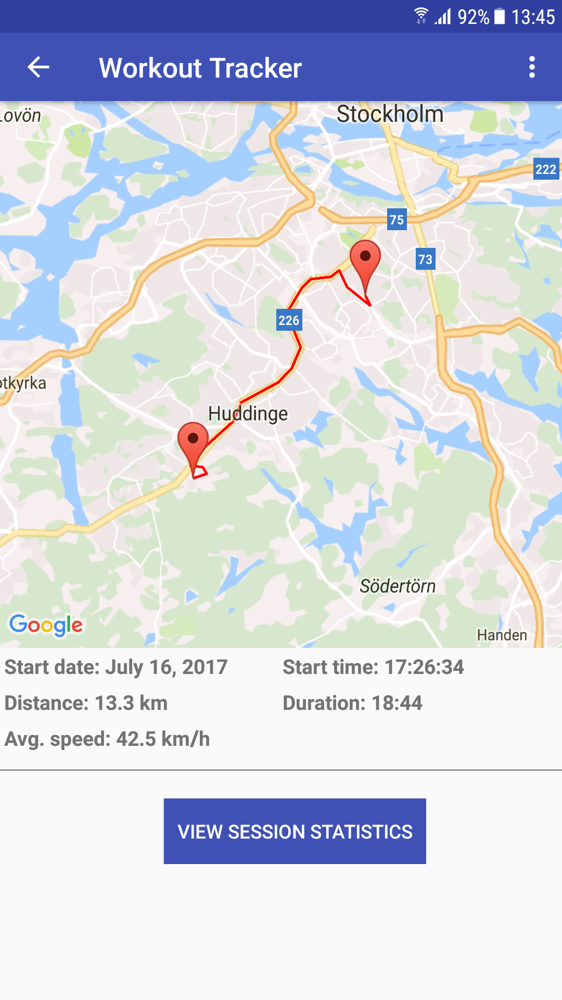
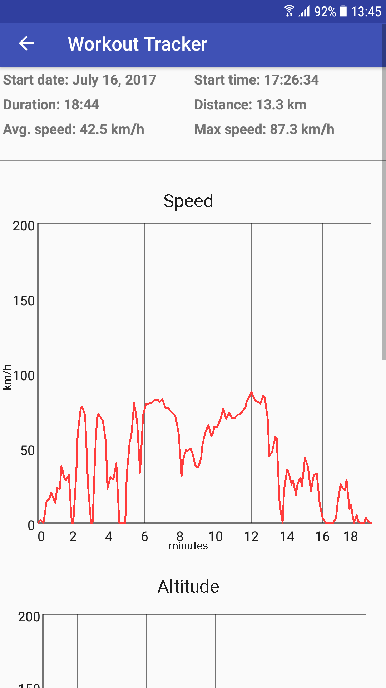

# WorkoutTracker
Workout Tracker is an Android app that tracks a user´s location in real-time when performing a workout session (exercising). 
Primarly the app was developed for tracking a bicycle session, but it can of course be used for any type of similar exercise. 
When the user is done exercising the app displays a map with the session route, charts (speed and altitude) and data about the 
session for the user.

The user´s locations in the session are tracked and stored in a SQLite database using a background service. Every 5th second a location is stored. Google Maps API v2 is used for everything location-related.

Important note: This app was developed for/on a Samsung Galaxy S7 device using a 1920*1080 resolution. It may not look as intended on devices with other screen sizes and resolutions. 

## Installation
A google maps api key must be set in the manifest file (it has been removed for obvious reasons). Otherwise installation and usage is self-explanatory.

## Screenshots

